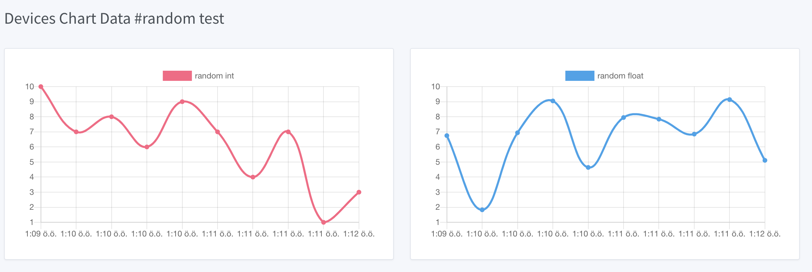
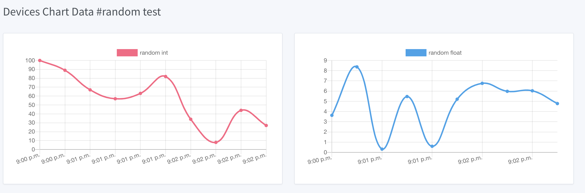

*********
Send Data
*********

HTTP Send Data
**************

To send data, you must first add a device. Special read and write "API KEY" when the device is created
Data processing is performed according to the access method (POST, GET, POST/GET) that is generated and determined.

For example; Let our device be in a structure that receives humidity, heat and light values.
For this example, the device named "#100 - Demo Data HTTP" was created on iothook.com.
`IoThook <https://iothook.com/en/device/settings/650/>`_ .

Let the IoT device read the data from the sensors and send this data to us once every 15 seconds, a total of 100 times.

You can access the read and write API Keys created for the #100 iot device from the IoThook dashboard.

The API ENDPOINT address we will use to send data to IoThook servers with Python is *https://iothook.com/api/update/*.
Writing *api_key* information is needed to send data. You can access this KEY from the device **settings** page.

There are 2 required fields to send data. These fields are **api_key** and **field_1** fields. APIKEY your device ownership
*field_1* absolutely must be because it validates and must have at least one data field. Other fields defined
even if they are not sent, they are recorded as **None**.

Send JSON Data in POST with Python
==================================

In this example, JSON data is sent to the device channel named "#100 - Demo Data HTTP" using the HTTP POST method with
Python. When the data is sent successfully, Json REST output of the data is received. You can do this with the
*response.json()* method, we are doing.

Example output:

    >>> {'device': 650, 'field_1': '6', 'field_2': '3.49', 'field_3': '22', 'field_4': None, 'field_5': None, 'field_6': None, 'field_7': None, 'field_8': None, 'id': 502491, 'pub_date': '2019-08-31T01:07:29.438160', 'remote_address': '88.242.135.167&python-requests/2.18.4&HTTP/1.1'}

Send JSON Data in POST with Python Examples:
--------------------------------------------

You can find this example and others at `IoT Examples Github <https://github.com/electrocoder/IOThook/blob/master/examples/http/python/iot_post_json_update_post.py>`_.

.. highlight:: py
.. literalinclude:: /../../examples/http/python/iot_post_json_update_post_1.py
    :caption: iot_post_json_update_post_1.py
    :name: iot_post_json_update_post_1.py

Send JSON Data in POST with Python Examples 2:
----------------------------------------------

You can find this example and others at `IoT Examples Json Post 1 Github <https://github.com/meseiot/iot-examples/blob/master/http/python/iot_post_json_update_post_1.py>`_.

.. highlight:: py
.. literalinclude:: /../../examples/http/python/iot_post_json_update_post_2.py
    :caption: iot_post_json_update_post_2.py
    :name: iot_post_json_update_post_2.py

Send JSON Data in POST with Python Examples 3:
----------------------------------------------

You can find this example and others at `IoT Examples Json Update 2 Github <https://github.com/meseiot/iot-examples/blob/master/http/python/iot_post_json_update_post_2.py>`_.

.. highlight:: py
.. literalinclude:: /../../examples/http/python/iot_post_json_update_post_3.py
    :caption: iot_post_json_update_post_3.py
    :name: iot_post_json_update_post_3.py

Send Data in GET with Python
============================

With the IoThook Api v6 update, it allows sending data with the GET method.

To send data, you must first add a device. Special read and write "API KEY" when the device is created Data processing
is performed according to the access method (POST, GET, POST/GET) that is generated and determined.

For example; Let our device be in a structure that receives humidity, heat and light values. For this example,
the device named "#100 - Demo Data HTTP" was created on iothook.com.
`IoThook <https://iothook.com/en/device/settings/650/>`_ .

Let the IoT device read the data from the sensors and send this data to us once every 15 seconds, a total of 100 times.

You can access the read and write API Keys created for the #100 iot device from the IoThook dashboard.

The API ENDPOINT address we will use to send data to IoThook servers with Python is https://iothook.com/api/update/.
Writing api_key information is needed to send data. You can access this KEY from the device settings page.

There are 2 required fields to send data. These fields are api_key and field_1 fields. APIKEY your device ownership
field_1 absolutely must be because it validates and must have at least one data field. Other fields defined even if
they are not sent, they are recorded as None.

Send Data in GET with Python Examples:
--------------------------------------

You can find this example and others at `IoT Examples Get Write Github <https://github.com/meseiot/iot-examples/blob/master/http/python/iot_get_write.py>`_.

.. highlight:: py
.. literalinclude:: /../../examples/http/python/iot_get_write_1.py
    :caption: iot_get_write_1.py
    :name: iot_get_write_1.py

Send Data in GET with Python Examples 2:
----------------------------------------

You can find this example and others at `IoT Examples Get Write 1 Github <https://raw.githubusercontent.com/meseiot/iot-examples/master/http/python/iot_get_write_1.py>`_.

.. highlight:: py
.. literalinclude:: /../../examples/http/python/iot_get_write_2.py
    :caption: iot_get_write_2.py
    :name: iot_get_write_2.py

Arduino and ESP8266
===================

Arduino and ESP8266 HTTP Post Examples.

Arduino and ESP8266 HTTP POST Send Data
---------------------------------------

In this example, Arduino code is given for sending data to iothook with ESP8266 connected to Arduino Uno with RX and TX.
In the example, random numbers between 0-100 were generated and the device was sent to the device with
"#100 - Demo Data HTTP" on iothook.

You can find this example and others at `IoT Examples ESP8266 Post Github <https://github.com/meseiot/iot-examples/blob/master/http/arduino/esp8266/arduino_esp8266_post_send_data.ino>`_.

.. highlight:: c
.. literalinclude:: /../../examples/http/arduino/esp8266/arduino_esp8266_post_send_data.ino
    :caption: arduino_esp8266_post_send_data.ino
    :name: arduino_esp8266_post_send_data.ino

Arduino and ESP8266 HTTP POST Send Data 2
-----------------------------------------

In this example, Arduino code is given for sending data to iothook with ESP8266 connected to Arduino Uno with RX and TX.
In the example, random numbers between 0-100 were generated and the device was sent to the device with
"#100 - Demo Data HTTP" on iothook.

You can find this example and others at `IoT Examples ESP8266 Post Send Github <https://github.com/meseiot/iot-examples/blob/master/http/arduino/esp8266/arduino_esp8266_post_send_data_2.ino>`_.

.. highlight:: c
.. literalinclude:: /../../examples/http/arduino/esp8266/arduino_esp8266_post_send_data_2.ino
    :caption: arduino_esp8266_post_send_data_2.ino
    :name: arduino_esp8266_post_send_data_2.ino

Arduino, ESP8266, Nodemcu Send Data in GET
==========================================

With the IOThook Api v1.4 update, it allows sending data with the GET method.

You can find this example and others at `IOTHOOK Git <https://github.com/electrocoder/IoThook>`_

Here is an example of sending data using the Get method with Arduino, ESP8266, NodeMCU:

.. highlight:: c
.. literalinclude:: /../../examples/http/arduino/arduino_nodemcu_esp8266_temp_hum_send_data.ino
    :caption: arduino_nodemcu_esp8266_temp_hum_send_data.ino
    :name: arduino_nodemcu_esp8266_temp_hum_send_data.ino

ESP8266EX Wemos Send Data in GET
================================

ESP8266EX Wemos D1 mini v3 HTTP Send Method.

You can find this example and others at `IOTHOOK Git <https://github.com/electrocoder/IoThook>`_

Here is an example of sending data using the Get method with NodeMCU:

.. highlight:: c
.. literalinclude:: /../../examples/http/nodemcu/esp8266ex_send_http_data.ino
    :caption: esp8266ex_send_http_data.ino
    :name: esp8266ex_send_http_data.ino

NodeMCU Send Data in GET
========================

With the IOThook Api v1.4 update, it allows sending data with the GET method.

You can find this example and others at `IOTHOOK Git <https://github.com/electrocoder/IoThook>`_

Here is an example of sending data using the Get method with NodeMCU:

.. highlight:: c
.. literalinclude:: /../../examples/http/nodemcu/nodemcu_send_data_get.ino
    :caption: nodemcu_send_data_get.ino
    :name: nodemcu_send_data_get.ino

GO Send Data in GET
===================

With the IOThook Api v1.4 update, it allows sending data with the GET method.

You can find this example and others at `IOTHOOK Git <https://github.com/electrocoder/IoThook>`_

Here is an example of sending data using the Get method with Go Language:

Go Language Send Data with GET Method
-------------------------------------

.. highlight:: go
.. literalinclude:: /../../examples/http/go/send_data_in_get.go
    :caption: send_data_in_get.go
    :name: send_data_in_get.go

Go Language Send Data with GET Method 2
---------------------------------------

.. highlight:: go
.. literalinclude:: /../../examples/http/go/send_data_in_get_2.go
    :caption: send_data_in_get_2.go
    :name: send_data_in_get_2.go

PHP Send Data in GET
====================

With the IOThook Api v1.4 update, it allows sending data with the GET method.

You can find this example and others at `IOTHOOK Git <https://github.com/electrocoder/IoThook>`_

Here is an example of sending data using the Get method with PHP Lang.:

.. highlight:: php
.. literalinclude:: /../../examples/http/php/send_data_in_get.php
    :caption: send_data_in_get.php
    :name: send_data_in_get.php

NodeJS Send Data in GET
=======================

With the IOThook Api v1.4 update, it allows sending data with the GET method.

You can find this example and others at `IOTHOOK Git <https://github.com/electrocoder/IoThook>`_

Here is an example of sending data using the Get method with NodeJS:

.. literalinclude:: /../../examples/http/nodejs/send_data_in_get.js
    :language: js
    :caption: send_data_in_get.js
    :name: send_data_in_get.js

Javascript Jquery Ajax Send Data in GET
=======================================

With the IOThook Api v1.4 update, it allows sending data with the GET method.

You can find this example and others at `IOTHOOK Git <https://github.com/electrocoder/IoThook>`_

Here is an example of sending data using the Get method with Javascript Jquery Ajax:

.. literalinclude:: /../../examples/http/javascript/send_data_in_get_javascript.js
    :language: js
    :caption: send_data_in_get_javascript.js
    :name: send_data_in_get_javascript.js

Java Unirest Send Data in GET
=============================

With the IOThook Api v1.4 update, it allows sending data with the GET method.

You can find this example and others at `IOTHOOK Git <https://github.com/electrocoder/IoThook>`_

Here is an example of sending data using the Get method with Java:

.. literalinclude:: /../../examples/http/java/send_data_in_get.java
    :language: java
    :caption: send_data_in_get.java
    :name: send_data_in_get.java

Java Request Send Data in GET 2
===============================

With the IOThook Api v1.4 update, it allows sending data with the GET method.

You can find this example and others at `IOTHOOK Git <https://github.com/electrocoder/iothookdoc>`_

Here is an example of sending data using the Get method with Java:

.. literalinclude:: /../../examples/http/java/send_data_in_get_2.java
    :language: java
    :caption: send_data_in_get_2.java
    :name: send_data_in_get_2.java

Arduino ESP32 ESP-C3-13 Request Send Data in GET
================================================

Data will be sent to IoThook with HTTP GET method with ESP32 on Arduino IDE.

The device used in this project is the ESP-C3-13 produced by ai-thinker. The features of the device and the
settings for programming with Arduino IDE are as follows.

* Device: ESP-C3-13
* FCC ID: 2ATPO-ESP-C3-X C3-2M
* Device Doc.: https://docs.ai-thinker.com/_media/esp32/docs/esp-c3-12f_specification.pdf
* Arduino IDE Board Select: ESP32C3 Dev Module
* Arduino IDE CPU Frequency: 160MHZ
* Arduino IDE Flash Size: 2MB
* Arduino IDE Partition Schema: 2MB
* Arduino IDE MacOS Upload Speed: MacOS: 115200, Windows and Linux: 460800

You can find this example and others at `IOTHOOK Git <https://github.com/electrocoder/iothookdoc>`_

Here is an example of sending data using the Get method with C:

.. literalinclude:: /../../examples/http/esp32/esp32-c3/BasicHttpClient_ESP_C3_13/BasicHttpClient_ESP_C3_13.ino
    :language: c
    :caption: BasicHttpClient_ESP_C3_13.ino
    :name: BasicHttpClient_ESP_C3_13.ino

Arduino ESP32 ESP-C3-13 Request Send Data in GET
================================================

Data will be sent to IoThook with HTTP GET method with ESP32 on Arduino IDE.

The device used in this project is the ESP-C3-13 produced by ai-thinker. The features of the device and the
settings for programming with Arduino IDE are as follows.

* Device: ESP-C3-13
* FCC ID: 2ATPO-ESP-C3-X C3-2M
* Device Doc.: https://docs.ai-thinker.com/_media/esp32/docs/esp-c3-12f_specification.pdf
* Arduino IDE Board Select: ESP32C3 Dev Module
* Arduino IDE CPU Frequency: 160MHZ
* Arduino IDE Flash Size: 2MB
* Arduino IDE Partition Schema: 2MB
* Arduino IDE MacOS Upload Speed: MacOS: 115200, Windows and Linux: 460800

You can find this example and others at `IOTHOOK Git <https://github.com/electrocoder/iothookdoc>`_

Here is an example of sending data using the Get method with C:

.. literalinclude:: /../../examples/http/esp32/esp32-c3/BasicHttpClient_ESP_C3_13/BasicHttpClient_ESP_C3_13.ino
    :language: c
    :caption: BasicHttpClient_ESP_C3_13.ino
    :name: BasicHttpClient_ESP_C3_13.ino

MQTT Send Data Publish
**********************

Hello; In this help file, we will try to do everything you need to know about the MQTT messaging protocol and
any IO operations you need. These examples should be customized to your device and MQTT Broker. For this
reason, you should thoroughly learn why you want to use it and how it is applied. In a nutshell, MQTT uses
your Internet home network and Mobile GSM 3G, 4G, 4.5G and 5G networks to send and respond to messages to
your IoT devices.

You can make your MQTT experiments on the `IoThook MQTT <https://iothook.com/en/mqtt/full-featured-mqtt-client/>`_ MQTT Broker page here.

Arduino ESP32 ESP-C3-13 Send JSON Data Publish MQTT
===================================================

In this example, JSON data is sent to the device channel named "#100 - Demo Data HTTP" using the HTTP POST method with
Python. When the data is sent successfully, Json REST output of the data is received. You can do this with the
*response.json()* method, we are doing.

You can find this example and others at `IOTHOOK Git <https://github.com/electrocoder/iothookdoc>`_

Here is an example of sending data using the Get method with C:

.. literalinclude:: /../../examples/mqtt/esp32/esp32-c3/esp32_c3_mqtt_iot.ino
    :language: c
    :caption: esp32_c3_mqtt_iot.ino
    :name: esp32_c3_mqtt_iot.ino

